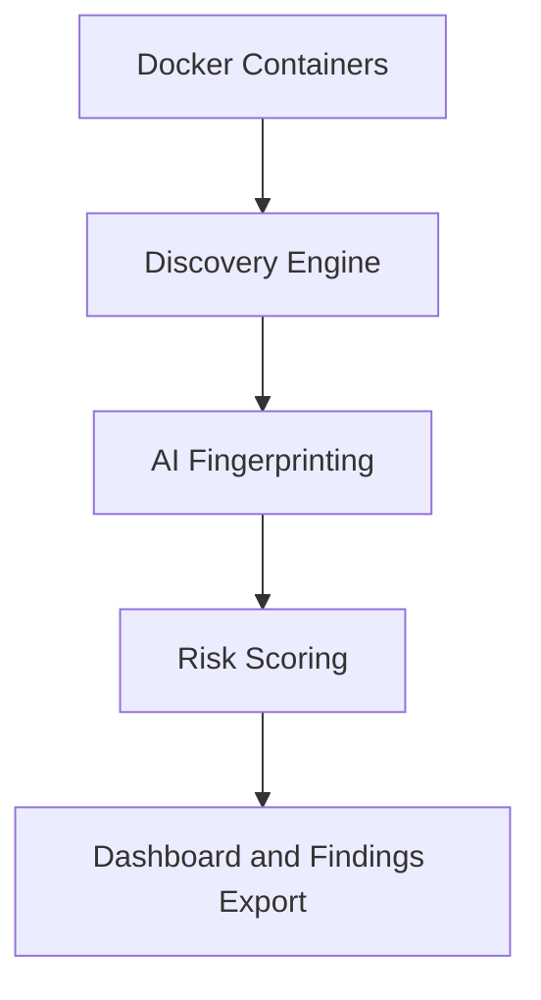

# AI Surface Scanner

AI Surface Scanner is a lightweight AI attack surface discovery and exposure assessment platform. It simulates a realistic enterprise AI environment by discovering AI runtimes, notebooks, inference APIs, AI web interfaces, vector database exposure, Docker containers, and optional Kubernetes workloads.

The project is intentionally beginner friendly. It avoids heavy enterprise complexity while still modeling the visibility questions security teams face when AI services appear across containers, developer systems, and cloud-native platforms.

## Architecture Diagram



## Discovery Sources

The scanner tracks where each finding came from:

- `docker_sdk` for running Docker containers.
- `http_probe` for common AI HTTP endpoints.
- `python_nmap` for AI-relevant open ports.
- `kubernetes_api` for Kubernetes pod image discovery.

This makes findings easier to explain during a security engineering assessment.

## AI Services and Exposures

Supported detections include:

| Service | Classification | Attack Surface |
| --- | --- | --- |
| Ollama | LLM Runtime | AI Runtime Exposure |
| Jupyter | AI Development Environment | Notebook Exposure |
| Streamlit | AI Web Interface | AI Application Exposure |
| Gradio | AI Web Interface | AI Application Exposure |
| MLFlow | AI Development Environment | Model Operations Exposure |
| Open WebUI | AI Web Interface | AI Chat Interface Exposure |
| vLLM | AI Inference API | Inference API Exposure |
| HuggingFace TGI | AI Inference API | Inference API Exposure |
| NVIDIA Triton | AI Inference API | Inference API Exposure |
| TorchServe | AI Inference API | Inference API Exposure |
| TensorFlow Serving | AI Inference API | Inference API Exposure |
| Ray Serve | AI Runtime | AI Runtime Exposure |
| Redis Vector DB | Vector Database | Vector Database Exposure |

## Network Scanning

Network scanning is supported with `python-nmap`. It checks AI-relevant ports and records findings only when the port maps to a known AI service or vector database exposure.

Example:

```powershell
python scanner.py --network-scan --network-target 127.0.0.1
```

The local nmap binary must be installed for `python-nmap` to run. If it is missing, the scanner logs a warning and continues with Docker and HTTP discovery.

## Kubernetes Pod Discovery

Kubernetes discovery is optional:

```powershell
python scanner.py --include-kubernetes
```

The scanner reads the current kubeconfig, enumerates pods, and fingerprints container images for AI workload indicators. This simulates cloud-native AI workload visibility without requiring complex cluster analysis.

## Exposure Categories

Findings are labeled with AI-specific exposure categories:

- `AI Runtime Exposure`
- `Notebook Exposure`
- `Inference API Exposure`
- `Vector Database Exposure`
- `AI Application Exposure`
- `AI Chat Interface Exposure`
- `Model Operations Exposure`
- `Unauthenticated AI Interface`
- `Authentication Prompt Detected`

These labels make findings read like AI security exposures instead of generic open-port results.

## Why AI Attack Surface Discovery Matters

Enterprise AI services often appear through rapid experimentation, containerized model deployments, internal notebooks, and developer-facing dashboards. These assets may not flow through standard application onboarding or asset inventory processes.

AI attack surface discovery helps security teams identify exposed model runtimes, inference APIs, notebook environments, vector databases, and cloud-native AI workloads before they become unmanaged risk.

## Risks Modeled

The project focuses on realistic AI security visibility concerns:

- AI runtime exposure can allow unauthorized model interaction.
- Notebook exposure can allow code execution or sensitive data access.
- Inference API exposure can lead to model abuse, cost abuse, or prompt-based data leakage.
- Vector database exposure can reveal embeddings, retrieval data, or application memory.
- Cloud-native AI workload exposure can leave internal model infrastructure reachable from unexpected paths.

## Findings Output

`findings.csv` includes:

- discovery source tracking
- detected AI service
- service classification
- attack surface classification
- endpoint and HTTP metadata
- exposure category
- issue and recommendation
- attack path
- MITRE ATLAS tactic and technique
- severity and numeric risk score

## Dashboard

The Streamlit dashboard includes:

- metric cards
- risk severity chart
- service breakdown
- exposure category breakdown
- discovery source tracking
- AI asset inventory
- attack surface classification
- attack path visualization section
- AI-specific exposure findings table

## Installation

Use PowerShell on Windows:

```powershell
python -m venv venv
.\venv\Scripts\Activate.ps1
pip install -r requirements.txt
```

Docker Desktop should be running for Docker discovery. Install nmap if you want to use `--network-scan`.

## Usage

Run the standard scanner:

```powershell
python scanner.py
```

Run with network scanning:

```powershell
python scanner.py --network-scan --network-target 127.0.0.1
```

Run with Kubernetes discovery:

```powershell
python scanner.py --include-kubernetes
```

Run everything:

```powershell
python scanner.py --network-scan --include-kubernetes
```

Start the dashboard:

```powershell
streamlit run dashboard.py
```

## Assessment Scope

This project performs discovery, fingerprinting, exposure classification, and reporting. It does not perform exploitation, credential discovery, authentication bypass, or vulnerability validation.

It is suitable for:

- AI attack surface discovery exercises
- cloud-native AI workload visibility assessments
- container security demonstrations
- AI security engineering portfolio work
- enterprise AI exposure simulations
